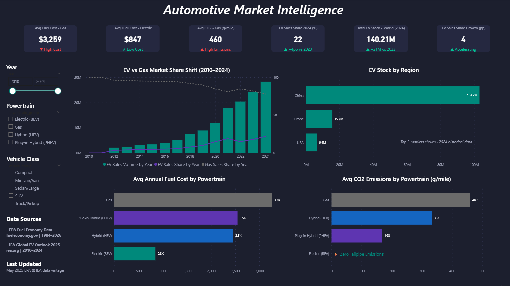

# Automotive Market Intelligence Dashboard

A professional, end-to-end BI project built on real government data. Analyzes the US and global automotive market across Gas, Hybrid, and Electric vehicles, covering efficiency, cost, emissions, and how market share is shifting over time.

> **Business question:** How is the automotive market shifting across powertrain types (Gas / Hybrid / Electric), and what does that mean for efficiency, cost, and market share?

---

## Dashboard Preview



---

## Key Findings

- **EVs cost 75% less to fuel annually.** Gas averages $3,259/year vs Electric at $847
- **Zero tailpipe emissions** for Battery Electric Vehicles vs 460 g/mile for Gas
- **EV global sales share reached 22% in 2024**, up from under 1% in 2010
- **140.21M EVs on the road globally** as of 2024
- **China dominates EV adoption.** 103.2M stock vs Europe's 15.7M and USA's 6.4M

---

## Tech Stack

| Layer | Tool |
|---|---|
| ETL / Data Pipeline | SSIS (SQL Server Integration Services) |
| Database | SQL Server (SSMS) |
| Dashboard | Power BI Desktop |
| Data Sources | CSV + Excel (government datasets) |
| Version Control | Git + GitHub |

---

## Data Sources

Both sources are official government datasets used by analysts and researchers, not sample or synthetic data.

**EPA Fuel Economy Data**
- U.S. Department of Energy / EPA: [fueleconomy.gov](https://fueleconomy.gov/feg/download.shtml)
- 49,846 vehicles | Model years 1984–2026 | 22 columns loaded

**IEA Global EV Outlook 2025**
- International Energy Agency: [iea.org](https://www.iea.org)
- 16,436 rows | Historical data + projections | 2010–2024 (historical only)

---

## Project Structure

```
Personal_Repo/
  dashboard/
    dashboard_screenshot.png                 # Final Power BI dashboard screenshot
  docs/
    Automotive-Dashboard_Master-Roadmap.md   # Full phase-by-phase build log
  sql/
    create_tables.sql                        # Final SQL Server schema (EPA + IEA tables)
    validation_queries.sql                   # Data validation queries run post-load
  ssis/
    Package.dtsx                             # SSIS package: EPA + IEA data pipelines
```

---

## How It Was Built

**Phase 1: Data Assessment**
Profiled both source datasets, selected 22 of 84 EPA columns, defined business questions for each visual.

**Phase 2: Database Design**
Designed and created `AutomotiveDashboard_DB` in SQL Server with two target tables: `epa_vehicles` and `iea_ev_trends`.

**Phase 3: SSIS Pipeline**
Built two ETL pipelines in Visual Studio. The EPA pipeline required a Data Conversion transformation (CSV to unicode), a Derived Column transformation to create `powertrain_group`, `vclass_group`, and `trany_group`, and a TRUNCATE + reload pattern for idempotency. The IEA pipeline loaded cleanly from Excel with no transformation layer needed.

**Phase 4: Data Validation**
Verified row counts (49,846 EPA / 16,436 IEA), NULL distributions, powertrain classifications, and spot-checked known vehicles. Found and fixed a bug in the `powertrain_group` derived column expression that was misclassifying Gas vehicles as Other.

**Phase 5: Power BI Dashboard**
Connected Power BI to SQL Server in Import mode. Built DAX measures for fuel cost, CO2, EV sales share, EV stock, and YoY growth. Designed a dark-theme dashboard (1920x1080) with a consistent color vocabulary across all visuals.

---

## DAX Measures

```
Avg Fuel Cost - Gas = CALCULATE(AVERAGE(epa_vehicles[fuelCost08]), epa_vehicles[powertrain_group] = "Gas")
Avg Fuel Cost - Electric = CALCULATE(AVERAGE(epa_vehicles[fuelCost08]), epa_vehicles[powertrain_group] = "Electric (BEV)")
EV Sales Share Latest Year = CALCULATE(MAX(iea_ev_trends[value]), iea_ev_trends[parameter] = "EV sales share", iea_ev_trends[category] = "Historical", iea_ev_trends[year] = 2024, iea_ev_trends[region_country] = "World")
Total EV Stock Global = CALCULATE(SUM(iea_ev_trends[value]), iea_ev_trends[parameter] = "EV stock", iea_ev_trends[category] = "Historical", iea_ev_trends[year] = 2024, iea_ev_trends[region_country] = "World")
```

---

## Color Vocabulary

| Powertrain | Color |
|---|---|
| Gas | Warm Gray `#6B6B6B` |
| Electric (BEV) | Teal `#00897B` |
| Hybrid (HEV) | Steel Blue `#1565C0` |
| Plug-in Hybrid (PHEV) | Slate Purple `#5E35B1` |

---

*Built on real government data. Every decision documented. Every step verified.*
*Data vintage: EPA 1984–2026 · IEA 2010–2024*
